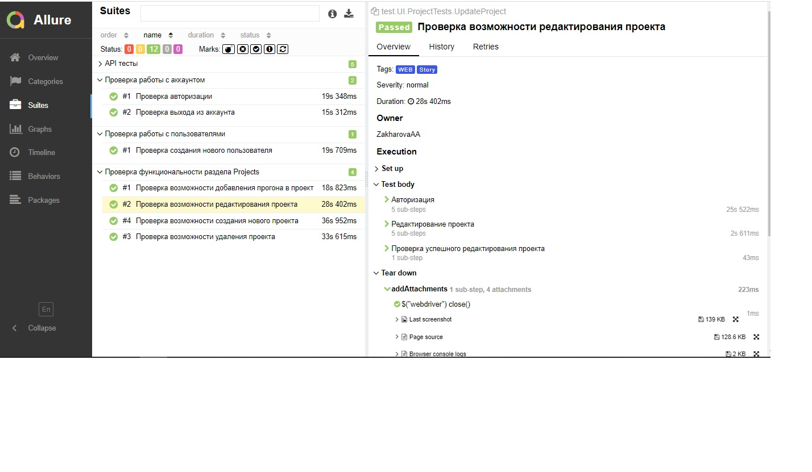

<h1 > Проект автоматизации тестирования UI и API для сайта <a href="https://www.testrail.com/">TestRail</a></h1>


## :bookmark_tabs: Содержание

* <a href="#tools">Технологии и инструменты</a>

* <a href="#cases">Реализованные проверки</a>

* <a href="#console">Запуск тестов из терминала</a>

* <a href="#jenkins">Запуск тестов в Jenkins</a>

* <a href="#allure">Отчеты в Allure Report</a>

* <a href="#allure-testops">Интеграция с Allure TestOps</a>

* <a href="#jira">Интеграция с Jira</a>

* <a href="#telegram">Уведомления в Telegram с использованием бота</a>

* <a href="#video">Пример прогона теста в Selenoid</a>

<a id="tools"></a>
## Технологии и инструменты

| Java                                                                                                    | IntelliJ Idea                                                                                                                | GitHub                                                                                                    | JUnit 5                                                                                                          | Gradle                                                                                                    | Selenide                                                                                                        | Selenoid                                                                                                                 |                                                                                                         Jenkins |
|:--------------------------------------------------------------------------------------------------------|------------------------------------------------------------------------------------------------------------------------------|-----------------------------------------------------------------------------------------------------------|------------------------------------------------------------------------------------------------------------------|-----------------------------------------------------------------------------------------------------------|-----------------------------------------------------------------------------------------------------------------|--------------------------------------------------------------------------------------------------------------------------|----------------------------------------------------------------------------------------------------------------:|
| <a href="https://www.java.com/"></a> | <a id ="tech" href="https://www.jetbrains.com/idea/"></a> | <a href="https://github.com/"></a> | <a href="https://junit.org/junit5/"></a> | <a href="https://gradle.org/"></a> | <a href="https://selenide.org/"></a> | <a href="https://aerokube.com/selenoid/"></a> | <a href="https://www.jenkins.io/"></a> |


| Jira                                                                                                                         | Allure                                                                                                                    | Allure TestOps                                                                                                      |
|:-----------------------------------------------------------------------------------------------------------------------------|---------------------------------------------------------------------------------------------------------------------------|---------------------------------------------------------------------------------------------------------------------|
| <a href="https://www.atlassian.com/ru/software/jira"></a> | <a href="https://github.com/allure-framework"></a> | <a href="https://qameta.io/"></a> |

<a id="cases"></a>
## :ballot_box_with_check: Реализованные проверки

- :small_blue_diamond: Параметризованный тест смены языка на русский, итальянский, немецкий
- :small_blue_diamond: Проверка результатов поисковой выдачи на главной странице
- :small_blue_diamond: Проверка содержимого хедер меню
- :small_blue_diamond: Проверка поиска пользователей (друзей)
- :small_blue_diamond: Проверка наличия поля поиска при выборе категории в меню Поддержка
- :small_blue_diamond: Добавление игры в корзину
- :small_blue_diamond: Удаление игры из корзины

<a id="console"></a>
## :computer: Запуск тестов из терминала
### Локальный запуск тестов

```
gradle clean test 
```

### Удаленный запуск тестов

```
gradle clean test 
"-Dbrowser=${BROWSER}" 
"-DbrowserVersion=${BROWSER_VERSION}" 
"-DbrowserSize=${BROWSER_SIZE}" 
"-DremoteUrl=${REMOTE_URL}"
```

> `${BROWSER}` - наименование браузера (_по умолчанию - <code>chrome</code>_).
>
> `${BROWSER_VERSION}` - версия браузера (_по умолчанию - <code>100.0</code>_).
>
> `${BROWSER_SIZE}` - размер окна браузера (_по умолчанию - <code>1920x1080</code>_).
>
> `${REMOTE_URL}` - адрес удаленного сервера, на котором будут запускаться тесты.

<a id="jenkins"></a>
## </a> Запуск тестов в Jenkins

<a target="_blank" href="https://jenkins.autotests.cloud/job/Nastya-Leto_API_Project/
/">Сборка в Jenkins</a>
<p align="center">

<a href="https://jenkins.autotests.cloud/job/AD_demo_ui_steam/"></a>

> Сборка с параметрами позволяет перед запуском изменить параметры для сборки (путем выбора из списка или прямым указанием значения).
> Клик по иконкам Allure TestOps и Allure Report позволяет перейти на просмотр страниц с тестовой документацией и отчетов.

<a href="https://jenkins.autotests.cloud/job/AD_demo_ui_steam/"></a>
</p>

<a id="allure"></a>
## </a> Отчеты в [Allure Report](https://jenkins.autotests.cloud/job/18-johnnyhlammaster-steamUiProject/20/allure/)

### Основное окно

<p align="center">

</p>

### Тесты

>К каждой проверке прилагается скриншот страницы последнего действия в тесте, логи и видео.

<p align="center">

</p>

<a id="allure-testops"></a>
## </a> Интеграция с [Allure TestOps](https://allure.autotests.cloud/project/2296/dashboards)

>Интеграция Allure TestOps с Jenkins позволяет запускать несколько выборочных тестов и следить за их выполнением в онлайн формате.

<p align="center">

</p>

>Прохождения тестов можно представить ввиде графиков.

<p align="center">

</p>

>Кейсы находятся в актуальном состоянии, поскольку сценарии выгружаются из кода.

<p align="center">

</p>

<a id="jira"></a>
## </a> Интеграция с [Jira](https://jira.autotests.cloud/browse/HOMEWORK-552)

### Связка Jira и Allure TestOps
<p align="center">

</p>


<a id="telegram"></a>
## </a> Уведомления в Telegram с использованием бота

<p >

</p>

<a id="video"></a>
## </a> Пример прогона теста в Selenoid

> Видео к прохождению теста "Добавление игры в корзину".
<p align="center">
  
</p>